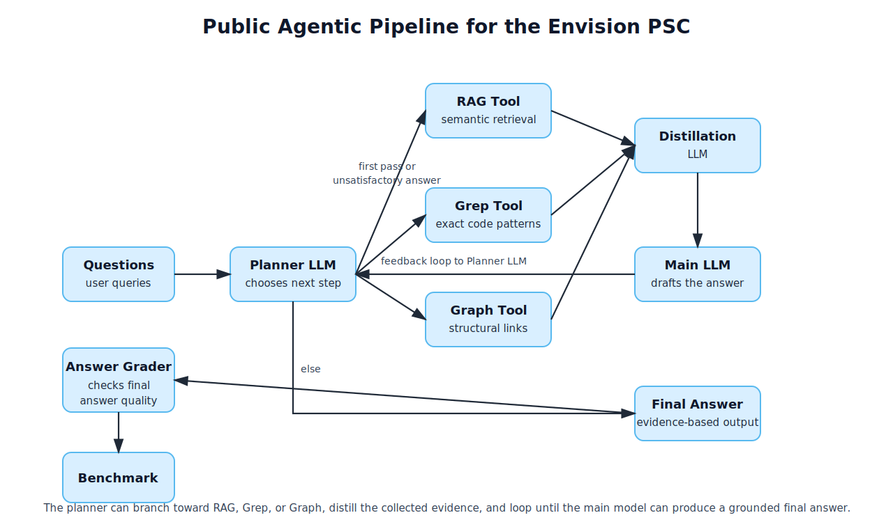

# Project Architecture

The **Envision Copilot** is built around an agentic workflow that orchestrates specialized tools to extract information from a proprietary DSL codebase.

## 🗺️ System Overview

The following diagram illustrates the high-level architecture and the flow of information between the user, the agent, and the specialized engines.

## 🔄 Agentic Workflow (Pipeline)
The core logic resides in the **[`pipeline/agent_workflow/`](https://github.com/ClementLokad/llm-DSL-info-extraction/tree/main/pipeline/agent_workflow/)** directory.
- **Planner (LLM)**: Analyzes the user query and decides which tool to call next.
- **Solvers**: Specialized routines that execute tool calls and format evidence.
- **Grader**: Validates the final answer against the collected evidence to prevent hallucinations.

## 🧠 Specialized Engines

### 1. Semantic Architecture (RAG)
Located in the **[`rag/`](https://github.com/ClementLokad/llm-DSL-info-extraction/tree/main/rag/)** directory.
This component handles semantic indexing and retrieval. It allows the agent to find conceptually relevant documentation or code patterns.
- **Capabilities**: Hybrid chunking, multi-modal indexing, and summarized retrieval.
- **Interface**: [RAG Tool](tools/rag_tool.md).

### 2. Dependency Graph (Graph)
Located in the **[`env_graph/`](https://github.com/ClementLokad/llm-DSL-info-extraction/tree/main/env_graph/)** directory.
Provides a deep static analysis of the Envision codebase to build a topological map of the project.
- **Capabilities**: File I/O tracking, module imports, and function definition mapping.
- **Interface**: [Graph Tool](tools/graph_tool.md).

### 3. Lexical Search (Grep)
Integrated directly into the workflow via the [Grep Tool](tools/grep_tool.md).
It performs exact text matching on parsed code blocks to locate precise variable names or syntax motifs.
